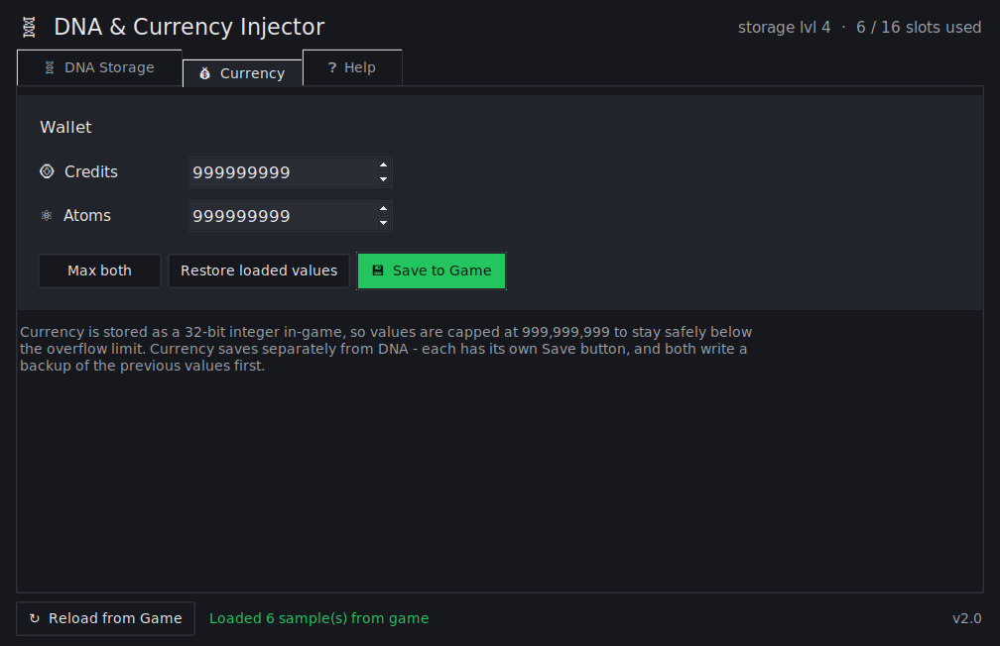

# DNA & Currency Injector — Adult VR Game Room

A small, open-source Windows GUI for editing your **own single-player save** in
[*Adult VR Game Room*](https://www.adultvrgameroom.com/). It reads and writes
the game's Unity PlayerPrefs (stored in the Windows registry) so you can:

- 🧬 **Add / remove DNA samples** — pick race, rarity, gender and quantity;
  realm and sell price auto-fill. The game's 16-slot storage cap is enforced.
- 💰 **Set Credits and Atoms** — type a value or click **Max both**
  (999,999,999).
- 💾 **Automatic backups** — every save writes a timestamped backup of the
  previous values first, and saving is blocked while the game is running so
  nothing gets clobbered.

Built with Python's standard library only (`tkinter` + `winreg`) — no pip
packages needed to run it. The window sizes itself to fit the UI, so it works
on high-DPI / scaled displays out of the box.

| DNA Storage | Currency |
|---|---|
|  |  |

---

## Download & run

### Option A — grab the EXE (easiest)

Download `DNA Injector.exe` from the [Releases](../../releases) page and
double-click it. Nothing to install.

> #### ⚠ Windows will probably warn you about the EXE — that's normal
>
> Windows flags **any** downloaded `.exe` that isn't code-signed with an
> expensive certificate, which small free tools like this one don't have.
> It is **not** a virus detection. This project is fully open source — you can
> read [`dna_injector.pyw`](dna_injector.pyw) yourself and see exactly what it
> does (it only touches the game's registry key and writes backup files).
>
> To get past the warnings:
>
> 1. **Browser blocks the download** — click the download entry → **Keep** →
>    **Keep anyway** (Edge/Chrome may hide this under "…" / "Show more").
> 2. **"Windows protected your PC" (SmartScreen) when running it** — click
>    **More info** → **Run anyway**.
> 3. **Still blocked?** Right-click the EXE → **Properties** → tick
>    **Unblock** at the bottom → **OK**, then run it again.
>
> If you'd rather not trust a pre-built EXE at all, run the script directly
> (Option B) or [build the EXE yourself](#build-the-exe-yourself) — a locally
> built EXE isn't marked as downloaded, so Windows won't nag you about it.

### Option B — run the script

With [Python 3](https://www.python.org/downloads/) installed, double-click
**`Launch DNA Injector.bat`**, or run:

```bat
py dna_injector.pyw
```

---

## How to use

1. **Close the game completely.** It rewrites its save on exit, so any edits
   made while it's open get wiped.
2. Launch the tool — it loads your current samples, credits and atoms
   automatically. (**F5** reloads at any time.)
3. **DNA Storage tab:** choose Race / Rarity / Gender / Quantity on the right
   → **Add to Storage** → **Save to Game** (**Ctrl+S**). Remove rows with
   **Remove Selected**, the **Delete** key, or by double-clicking a row.
4. **Currency tab:** edit Credits / Atoms (or **Max both**) → **Save to
   Game**. Currency saves separately from DNA.
5. Launch the game and check your storage and wallet.

The **Help** tab inside the app has the same instructions plus a reference
table, and **File → Open Backup Folder** takes you straight to your backups.

---

## FAQ

**Is this a virus? My browser/Windows says it's unsafe.**
No — see the warning box above. Windows shows that for every unsigned
download. All the source code is in this repo; build the EXE yourself if you
want to be certain the binary matches the code.

**I saved but the game shows the old values.**
The game was still running when you saved — it overwrites the save on exit.
Close the game fully first, then save again. (The tool tries to detect this
and warn you.)

**How do I undo an edit?**
Every save first writes the previous values to
`%USERPROFILE%\AppData\LocalLow\AdultVRGameRoom\Adult VR Game Room\` as
`dna_backup_YYYYMMDD_HHMMSS.txt` / `currency_backup_YYYYMMDD_HHMMSS.txt`.
The DNA backup is the exact base64 string that was stored — write it back
with the game closed (or ask for help in Issues).

**Why is currency capped at 999,999,999?**
The game stores currency as a 32-bit integer (max ~2.1 billion). The cap
keeps you safely below the overflow limit.

---

## Build the EXE yourself

Requires Python 3 with pip. Double-click **`build_exe.bat`**, or run:

```bat
py -m pip install --upgrade pyinstaller
py -m PyInstaller --onefile --windowed --name "DNA Injector" dna_injector.pyw
```

The result lands at `dist\DNA Injector.exe`.

---

## How it works

Registry key: `HKCU\Software\AdultVRGameRoom\Adult VR Game Room`

| Value | Format |
|-------|--------|
| `stats_dna_samples_h3759496538` | base64( JSON `{"samples":[…]}` ) + null byte |
| `stats_credits_h981088197` | base64( ASCII integer ) + null byte |
| `stats_atoms_h684834367` | base64( ASCII integer ) + null byte |

**DNA sample schema** (each element):

```json
{"rarity": 1-5, "price": int, "dnaStorageIndex": 0-based, "race": "…", "gender": "f|m", "realm": int}
```

- **Rarity:** 1 Common · 2 Rare · 3 Epic · 4 Legendary · 5 Mythic
- **Race → realm** (all verified from live saves): human → 1, elf → 2,
  savage → 3, orc → 5, naiad → 2 *(naiad shares realm 2 with elf)*
- Slots are renumbered 0…n-1 on every save, so removing a row never leaves
  gaps.

---

## Disclaimer

This is an unofficial fan tool for editing **your own local, single-player
save**. It is **not affiliated with or endorsed by** the developers of Adult
VR Game Room. Edit only saves you own, keep the backups it makes, and use at
your own risk.

## License

[MIT](LICENSE) © 2026 NotNic182
