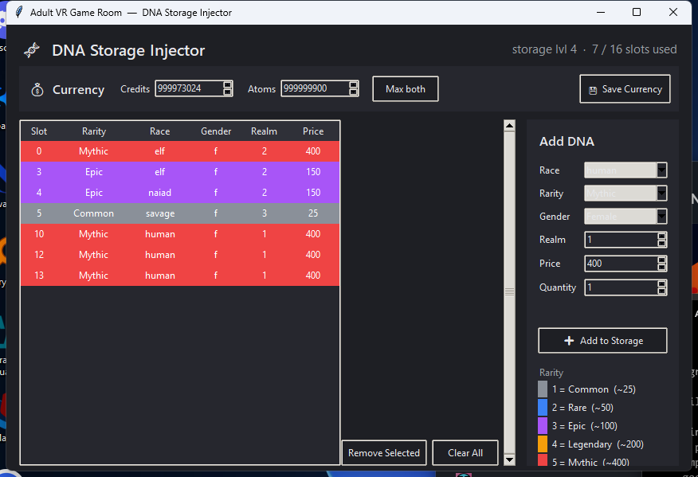

# Adult VR Game Room — DNA & Currency Injector

A small, dependency-free Windows GUI for editing your **own single-player save** in
[*Adult VR Game Room*](https://www.adultvrgameroom.com/) . It reads and writes the game's Unity PlayerPrefs
(stored in the Windows registry) so you can:

- **Add / remove DNA samples** — pick race, rarity, gender, quantity; realm and
  sell price auto-fill. 16-slot storage cap enforced.
- **Set Credits and Atoms** — type a value or click **Max both** (999,999,999).

Every save writes a timestamped backup first, and the tool refuses to write while
the game is running (the game overwrites its save on exit).

> Built with Python's standard library only — `tkinter` + `winreg`. No pip
> packages needed just to run it.



---

## Download & run

**Option A — grab the EXE (easiest).**
Download `DNA Injector.exe` from the [Releases](../../releases) page and
double-click it. Nothing to install.

**Option B — run the script.**
With [Python 3](https://www.python.org/downloads/) installed:

```bat
py dna_injector.pyw
```

or double-click **`Launch DNA Injector.bat`**.

---

## How to use

1. **Close the game completely.** It rewrites its save on exit, so any edits made
   while it's open get wiped.
2. Launch the tool — it loads your current samples, credits, and atoms.
3. **DNA:** on the right, choose Race / Rarity / Gender / Quantity → **Add to
   Storage**. Remove rows with **Remove Selected** (or double-click a row).
   Click **Save to Game**.
4. **Currency:** in the bar up top, edit Credits / Atoms (or **Max both**) →
   **Save Currency**. This is separate from the DNA save.
5. Launch the game and check your storage / wallet.

---

## Build the EXE yourself

Requires Python 3 with pip. Then either double-click **`build_exe.bat`**, or run:

```bat
py -m pip install --upgrade pyinstaller
py -m PyInstaller --onefile --windowed --name "DNA Injector" dna_injector.pyw
```

The result lands at `dist\DNA Injector.exe`.

---

## Reference (what it writes)

Registry key: `HKCU\Software\AdultVRGameRoom\Adult VR Game Room`

| Value | Format |
|-------|--------|
| `stats_dna_samples_h3759496538` | base64( JSON `{"samples":[…]}` ) + null byte |
| `stats_credits_h981088197` | base64( ASCII integer ) + null byte |
| `stats_atoms_h684834367` | base64( ASCII integer ) + null byte |

**DNA sample schema** (each element):

```json
{"rarity": 1-5, "price": int, "dnaStorageIndex": 0-based, "race": "…", "gender": "f|m", "realm": int}
```

- **Rarity:** 1 Common · 2 Rare · 3 Epic · 4 Legendary · 5 Mythic
- **Race → realm** (all verified from live saves): human → 1, elf → 2,
  savage → 3, orc → 5, naiad → 2 *(naiad shares realm 2 with elf)*
- Currency is a 32-bit int in-game; the tool clamps to 999,999,999 to stay
  safely below the overflow limit.

## Backups

Before each save the tool writes to
`%USERPROFILE%\AppData\LocalLow\AdultVRGameRoom\Adult VR Game Room\`:

- `dna_backup_YYYYMMDD_HHMMSS.txt` — previous DNA save string
- `currency_backup_YYYYMMDD_HHMMSS.txt` — previous credits + atoms

---

## Disclaimer

This is an unofficial fan tool for editing **your own local, single-player save**.
It is **not affiliated with or endorsed by** the developers of Adult VR Game Room.
Edit only saves you own, keep the backups it makes, and use at your own risk.

## License

[MIT](LICENSE) © 2026 notnic182
